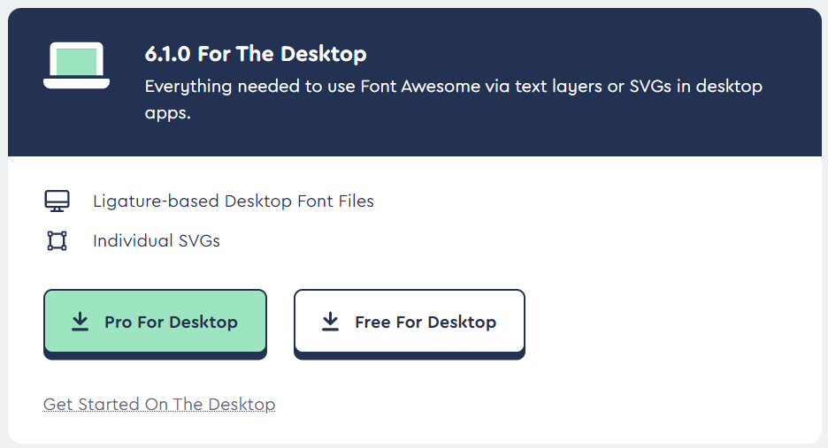
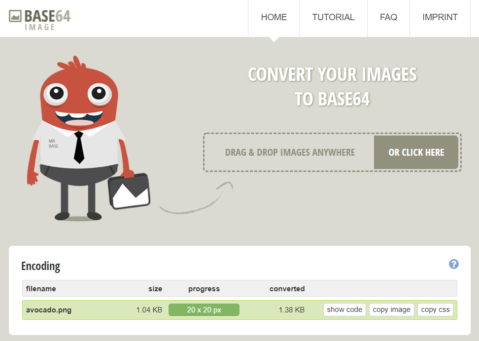
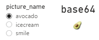
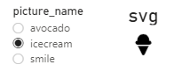
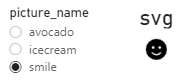

# Dynamic images in Power BI

Getting images to be dynamic and react to values from tables or slicers seems to have limited out of the box solutions in Power BI (at the time of the repository).

The solutions I have seen involve sourcing the images from a URL (already hosted images). Which is fine if you have access to a webserver to host them, but if you don't you may feel you are stuck.

## Another way using HTML

If you don't have access to a webserver to host your images, you can host the images as text in two ways.


### The images

#### SVG

To demonstrate using SVGs I sourced some from [Font Awesome](https://fontawesome.com/download).



#### Base64

To demonstrate using Base64 encoding I got a png of an emoji and used a [Base64 Image converter](https://www.base64-image.de/) to convert to Base64.



### Database table

I will demo this using a MySQL database.

```sql
DROP TABLE `powerbi_image`;
CREATE TABLE `powerbi_image` (
    `picture_id` int NOT NULL AUTO_INCREMENT
    , `picture_name` varchar(100) NULL DEFAULT NULL
    , `picture_type` varchar(100) NULL DEFAULT NULL
    , `picture_source_code` longtext NULL DEFAULT NULL
    , PRIMARY KEY (`picture_id`)
  )
COLLATE='latin1_swedish_ci'
ENGINE=MyISAM
;

-- The full code containing the SVG and Base64 images is in the repo.
INSERT INTO `powerbi_image`
  (`picture_name`, `picture_type`, `picture_source_code`)
  values
  ('smile', 'svg', '<html><svg><path d=""/></svg></html>')
  , ('icecream', 'svg', '<html><svg><path d=""/></svg></html>')
  , ('avocado', 'base64', '<html></html>')
;
```

### The Power BI dashboard

I have connected Power BI to the table and on the canvas I have three vixualisations:

- slicer (sourcing from the picture_name)
- card (sourcing the picture_type)
- HTML content (sourcing the picture_source_code)

  
  

